# ProductZo

This repository contains a full-stack application for managing products, featuring a React frontend and a Spring Boot backend with a MySQL database. The application provides users with a complete CRUD (Create, Read, Update, Delete) experience, allowing them to view, add, update, and organize products by category.

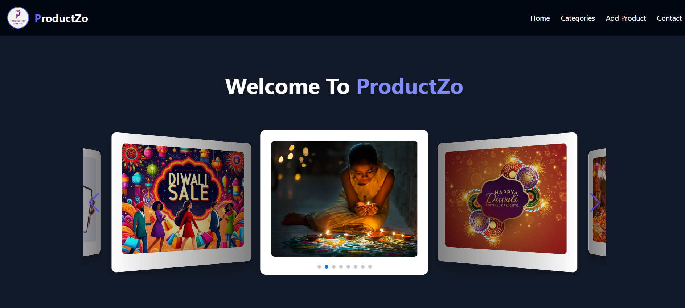


## Table of Contents
- [Features](#features)
- [Tech Stack](#tech-stack)
- [Installation and Setup](#installation-and-setup)
- [Project Structure](#project-structure)
- [Usage](#usage)
- [API Endpoints](#api-endpoints)
- [Contributing](#contributing)
- [License](#license)

## Features
- **Product Listing**: View a categorized list of products.
- **Add Product**: Create new product entries.
- **Update Product**: Modify details of existing products.
- **Product Details**: View detailed information about each product.
- **Responsive UI**: Modern, user-friendly interface built with React.

## Tech Stack
### Frontend
- **Framework**: React (with React Router for routing)
- **Libraries**:
  - `axios` for HTTP requests
  - `react-icons` for iconography
  - `react-slick` and `slick-carousel` for carousel functionality
  - `tailwindcss` for styling
- **Development Tools**:
  - Vite for fast build and development

### Backend
- **Framework**: Spring Boot
- **Dependencies**:
  - `spring-boot-starter-data-jpa` for database operations
  - `spring-boot-starter-web` for RESTful web services
  - `mysql-connector-j` for MySQL integration
  - `lombok` for reducing boilerplate code
  - `spring-boot-devtools` for enhancing the development experience


### Database
- **MySQL**: Relational database for storing product data.

## Installation and Setup
### Prerequisites
Ensure that you have the following installed:
- **Node.js** (for running the frontend)
- **Java 11 or higher** (for the backend)
- **MySQL** (as the database)


### Backend Setup
1. **Clone the repository** and navigate to the backend directory:
   ```bash
   git clone https://github.com/Dev-Hariprasath/ProductZo.git
   cd ProductZo/Back-End
   ```
2. **Configure the MySQL Database**:
   - Create a database named `product_db` in your MySQL server.
   - Update `application.properties` with your MySQL credentials:
     ```properties
     spring.datasource.url=jdbc:mysql://localhost:3306/product_db
     spring.datasource.username=your_username
     spring.datasource.password=your_password
     spring.jpa.hibernate.ddl-auto=update
     ```

3. **Build and run the application**:
   

### Frontend Setup
1. Navigate to the frontend directory:
   ```bash
   cd ProductZo/Front-End
   ```
2. **Install dependencies**:
   ```bash
   npm install
   ```
3. **Run the development server**:
   ```bash
   npm run dev
   ```
4. Access the application at [http://localhost:3000](http://localhost:3000).


## Project Structure
### Frontend (`/frontend`)
- `src/`
  - `components/`: Reusable UI components (e.g., `Navbar`, `Footer`, `ProductDetails`)
  - `Pages/`: Main pages such as `HomePage`
  - `App.jsx`: Main application file that includes routing

### Backend (`/backend`)
- `src/main/java/com/productzo/productzo/`
  - `model/`: Entity classes (e.g., `Product.java`)
  - `repository/`: Repository interfaces (e.g., `ProductRepo.java`)
  - `controller/`: Controllers for handling HTTP requests
  - `ProductzoApplication.java`: Main application class


## Usage
### Add a Product
Navigate to `/products/addProduct` and fill out the form to create a new product.

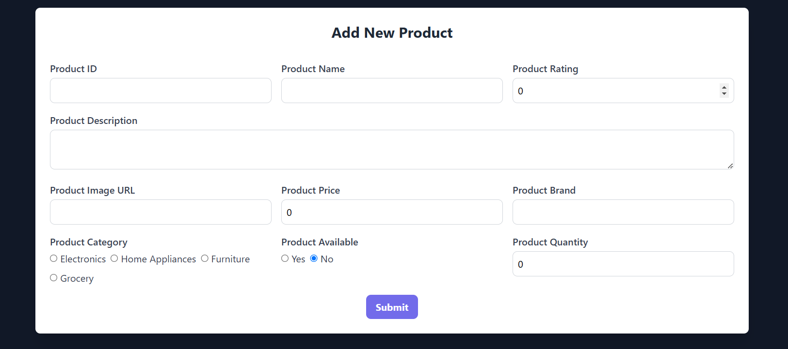

### Update a Product
Navigate to `/products/update/:productId`, edit the product details, and submit the form to update.

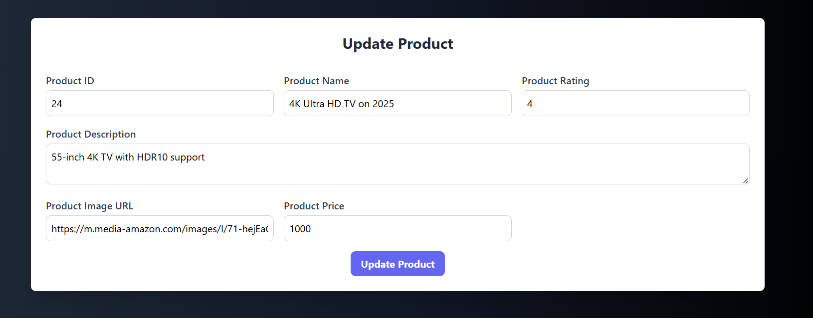

### View Product List
The home page displays a list of products categorized by type. Click on a product to view its details.

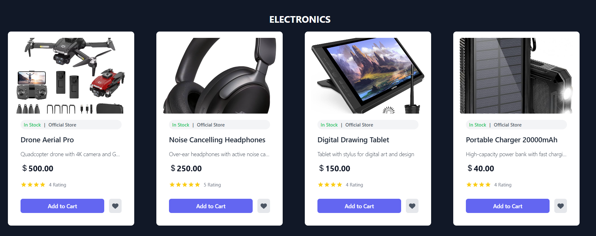


## API Endpoints
### Frontend (React.js)

1. **Retrieve all products**
   
   - **GET** `/productzo/api/products`
     
     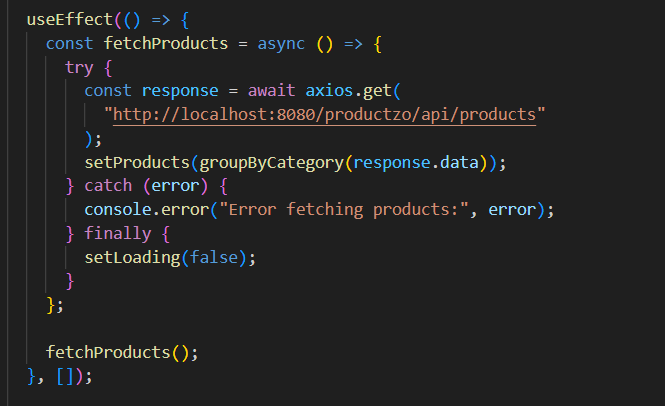
     

2. **Retrieve a product by ID**
   
   - **GET** `/productzo/api/products/${productId}`
     
     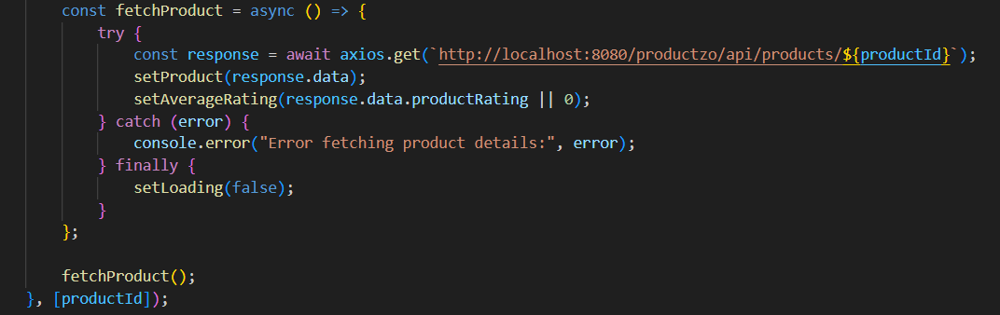
     

3. **Add a new product**
   
   - **POST** `/productzo/api/addProduct`
     
     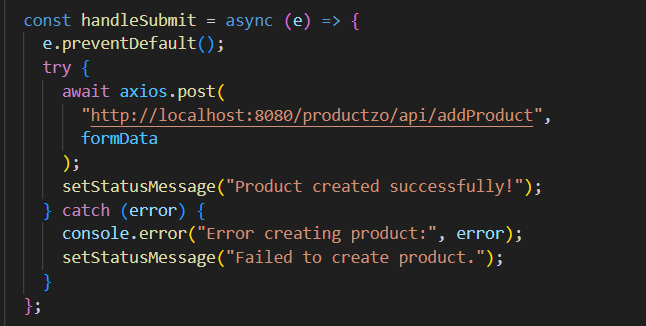
     

4. **Update a product**
   
   - **PUT** `/productzo/api/updateProduct`
     
     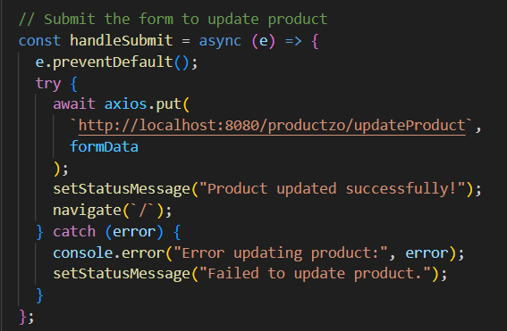
     

5. **Delete a product**
   
   - **DELETE** `/productzo/api/delete/${productId}`
     
     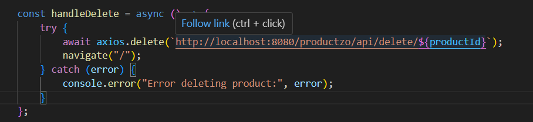


### Backend (Spring Boot)

1. **Retrieve all products**
   
   - **GET** `/api/products`
     
     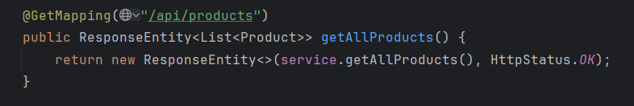


2. **Retrieve a product by ID**
   
   - **GET** `/api/products/{productId}`
     
     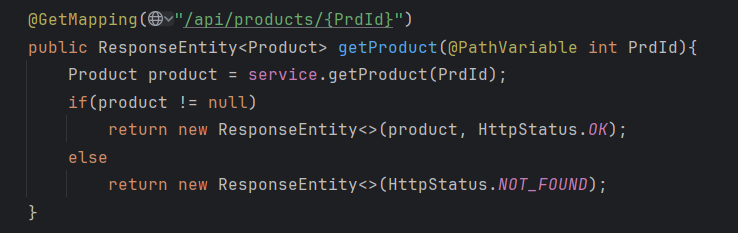


3. **Add a new product**
   
   - **POST** `/api/addProduct`
     
     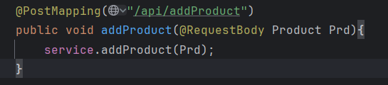
     

4. **Update a product**
   
   - **PUT** `/api/updateProduct`
     
     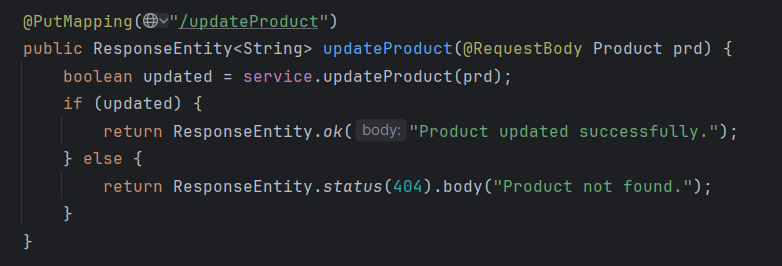
     

5. **Delete a product**
    
   - **DELETE** `/api/products/{productId}`
     
     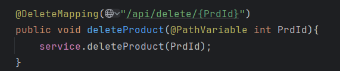

     

## Contributing
1. Fork the repository.
2. Create a new branch (`git checkout -b feature/YourFeature`).
3. Commit your changes (`git commit -m 'Add new feature'`).
4. Push to the branch (`git push origin feature/YourFeature`).
5. Open a Pull Request.

## License
This project is licensed under the MIT License.

--- 
